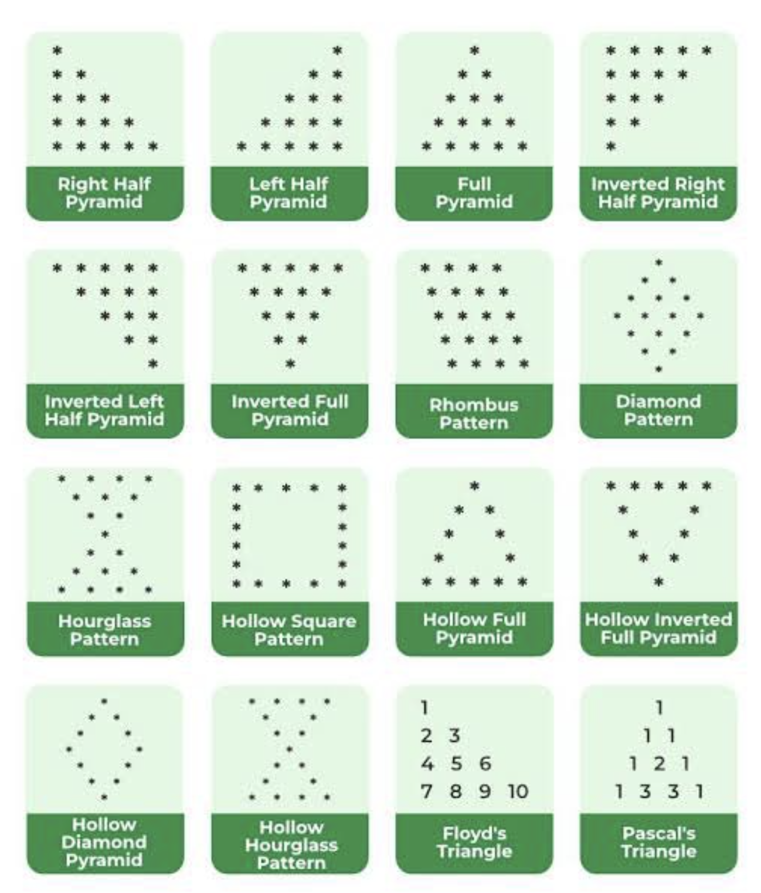

# Pyramid or Pattern Challenges

- Just read a thread that make me interested, i remember while in the campus 6years ago
- Challenge [source](https://x.com/mgppap/status/1791293197945380984/photo/1)
- Only answer that i fully understand within an hour, will complete other pattern after i read the algorithm (different commit)

## Run on Mac
1. Make sure you have c++ / g++, check using `% c++ --version`
2. You can run the executable file using `% ./file_name` then `enter`
3. Additional: You can make executable file by using `% c++ file_name.cpp -o file_name_target` then run again by using command number 2
